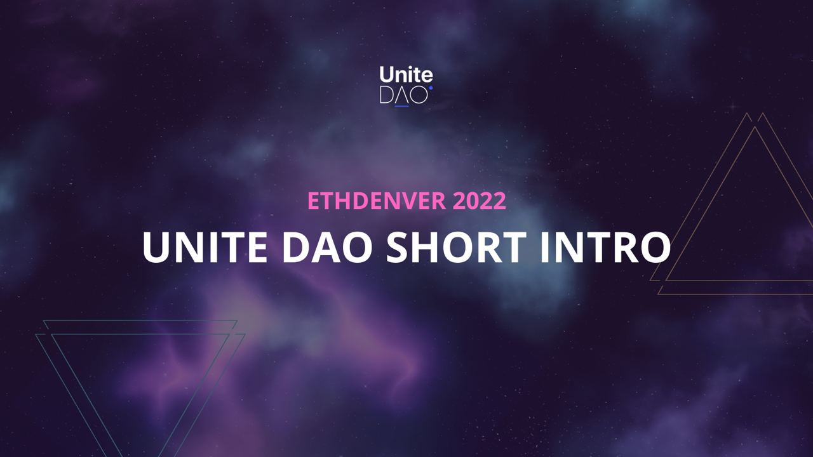

# ETH Denver 2022 and beyond.

###### 2022-02-24 Update.

We have met during ETH Denver to explain [Unite DAO](../README.md) in detail in order to get support from other DAOs, Projects, and Individuals.

## When
Feb 17, 2022; 3PM

## Where
"Jonas" Venue, Denver, USA

## About Unite DAO

***Trust coordination framework to elaborate and evolve standards for WEB3.***

Unite DAO aims to become a decentralized community-focused constant evolution of standards for the Blockchain ecosystem.

Web3 is growing fast, but we still lack a proper way to verify organizations. At the institutional level, we have a combination of CAs, Qualified Digital Signature, and Standardization Bodies (ISO, UNE…). Unfortunately, these traditional institutions are usually agencies with no transparency, interoperability, and modern tools to develop applications on top of them.

In the traditional Identity Landscape, Trust is achieved by centralizing and protecting existing players.  As a result, innovation is always slow and limited to small participants.

On the other hand, DAOs are becoming more popular and gaining traction as a transparent and efficient way of achieving consensus on different aspects of Society, including the Standards for WEB3. 

All the tools to achieve Trustless Interoperability are within our grasp — we need to bring them together in a digital-first institutional design.

# The Future for Unite DAO

We believe standards are a public good. Therefore people who make standards and maintain them should be paid well.

During the past month, we have been thinking about Tokenomics and the main features of the protocol native token — FIDE.

*Finally, we arrived at two main conclusions:*

- FIDE will give voting power over the DAO, the selection, and the creation of standards.
- FIDE must catch the long-term value creation of Unite DAO to guarantee financial sustainability.

*To start the project, we needed three things:*

1. A multidisciplinary core team is committed and involved with the project.
2. An initial amount of capital to bankroll the first phases of Unite DAO development.
3. A community conformed by key partners within the ecosystem.

So we did that!

We have a Team, and we have the Partners — people, protocols, and DAOs who want to join this fantastic community.

The time to decide how to raise funds has come.

We had in mind a couple of ideas, such as a TBE and a potential token swap. But, unfortunately, none of them were good enough ideas for us.

So finally, we realized the best way to raise funds and create a community simultaneously is a Genesis Event.

Soon we will give more details about our next steps. 
The WHEN and HOW still need to be confirmed.

***

💬 Always a good idea to join our [Discord Server.](https://discord.gg/7RwPerFPe8)

🆕 Check [New Updates.](https://github.com/Unite-DAO/Documentation/tree/main/updates)

🏠 Go back to [Home Page.](https://github.com/Unite-DAO/Documentation)

***

